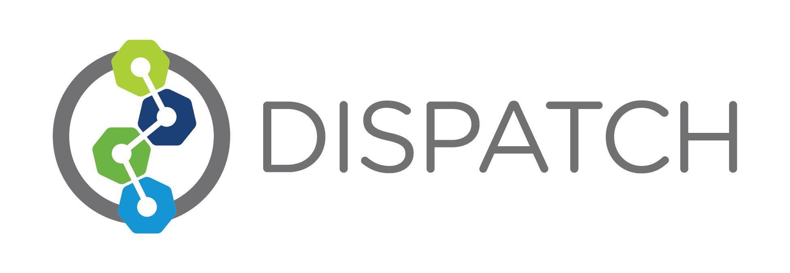
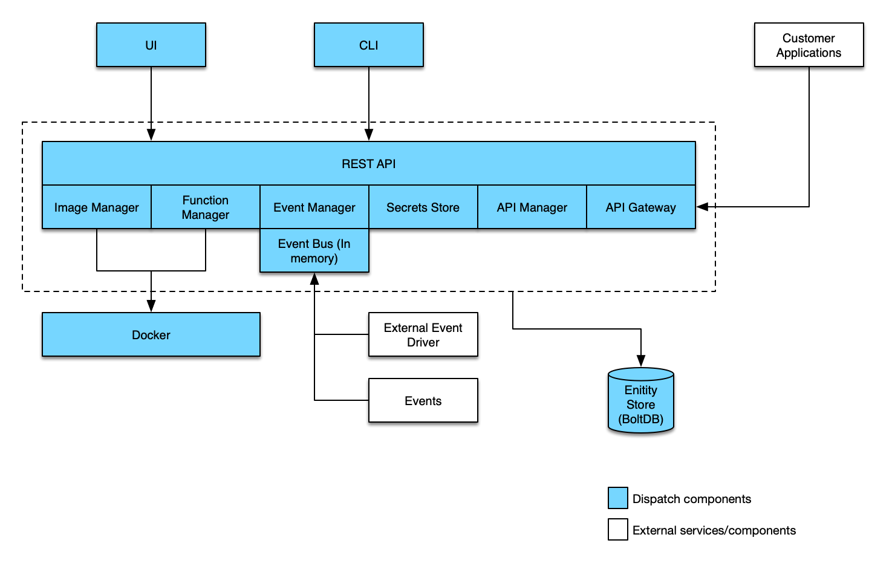

> **ATTENTION**: This is the Solo branch of Dispatch.  Read the [Dispatch
> Solo](#dispatch-solo) section to understand what that means.

Dispatch is a framework for deploying and managing serverless style applications.  The intent is a framework
which enables developers to build applications which are defined by functions which handle business logic and services
which provide all other functionality:

* State (Databases)
* Messaging/Eventing (Queues)
* Ingress (Api-Gateways)
* Etc.

Our goal is to provide a substrate which can be built upon and extended to serve as a framework for serverless
applications.  Additionally, the framework must provide tools and features which aid the developer in building,
debugging and maintaining their serverless application.

## Dispatch Solo

Dispatch Solo is a simplified branch of Dispatch.  The objective is to remove as many dependencies as possible
while maintaining functionlity.  Dispatch Solo is a single binary which only relies on Docker as dependency.
The trade-off of this simplification is scale and persistence.  However, it is the perfect platform for evaluation
and learning.

## Documentation and Quickstart

Checkout the detailed [documentation](https://vmware.github.io/dispatch) including a [quickstart guide](https://vmware.github.io/dispatch/documentation/front/quickstart).

## Architecture

The diagram below illustrates the different components which make up the Dispatch project:



## Installation

For a quickstart see the [developer documentation](#documentation-and-quickstart)

## Building

### Prerequisites

* Golang
* Docker

Clone the repository and update your GOPATH:

```bash
mkdir -p $HOME/dispatch/go/src/github.com/vmware
cd $HOME/dispatch/go/src/github.com/vmware
git clone git@github.com:vmware/dispatch.git
cd dispatch
git checkout origin/solo
export GOPATH=$HOME/dispatch/go
```

Build and run Dispatch CLI and server (Mac):

```bash
make darwin
cp ./bin/dispatch-darwin /usr/local/bin/dispatch
./bin/dispatch-server-darwin
```

Build and run Dispatch CLI and server (Linux):

```bash
make linux
cp ./bin/dispatch-linux /usr/local/bin/dispatch
./bin/dispatch-server-linux
```

Create dispatch config file $HOME/.dispatch/config.json like this:
```bash
mkdir $HOME/.dispatch
cat << EOF > $HOME/.dispatch/config.json
{
    "current": "solo",
    "contexts": {
        "solo": {
            "port": 8080,
            "scheme": "http",
            "organization": "dispatch-server",
            "cookie": "cookie",
            "insecure": true
        }
    }
}
EOF
```

## Testing

To run the end to end tests:

```bash
API_GATEWAY_HTTP_HOST=http://localhost:8081 ./e2e/scripts/run-e2e.sh e2e/tests
```

## Contributing

You are invited to contribute new features, fixes, or updates, large or small; we are always thrilled to receive pull
requests, and do our best to process them as fast as we can. If you wish to contribute code and you have not signed our
contributor license agreement (CLA), our bot will update the issue when you open a [Pull
Request](https://help.github.com/articles/creating-a-pull-request). For any questions about the CLA process, please
refer to our [FAQ](https://cla.vmware.com/faq).

Before you start to code, we recommend discussing your plans through a  [GitHub
issue](https://github.com/vmware/dispatch/issues) or discuss it first with the official project
[maintainers](AUTHORS.md) via the [#Dispatch Slack Channel](https://vmwarecode.slack.com/messages/dispatch/), especially
for more ambitious contributions. This gives other contributors a chance to point you in the right direction, give you
feedback on your design, and help you find out if someone else is working on the same thing.

## License

Dispatch is available under the [Apache 2 license](LICENSE).