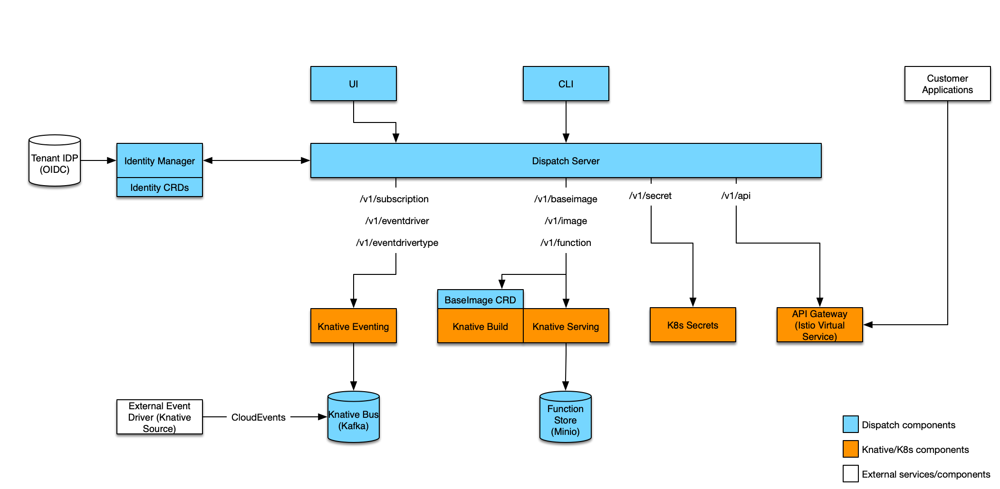

# Dispatch

Dispatch is an open source serverless platform aimed at addressing enterprise use-cases and requirements.  Specifically,
it enables function backed workloads with the following features:

* Authentication and Policy management integrated with OpenID compatible IDPs
* Managed source to function
* Integrated API gateway providing flexible HTTP routing to functions
* Extensible eventing system enabling integration with a wide variety of event sources
* Easy-to-use API

## Architecture

Dispatch heavily leverages both Kubernetes and the [Knative serverless components](https://knative.dev) to provide
the backend services for Dispatch.  By leveraging community driven components for the backend, we can concentrate on
providing higher level value.

For a deeper dive into any of the functional areas:

* [Image management](images.md)
* [Event management](events.md)
* [Function management](functions.md)
  - Function catalog
* [Identity and Access Managment](identity.md)
* [API Gateway](endpoints.md)
* CLI
* UI

All services are deployed as containers on Kubernetes (PKS).  There are some additional components called out in the
diagram which Dispatch depends on, but may be managed separately:

* Config DB (Etcd)
    * Possibly use the etcd which kubernetes uses.
* Docker Registry (Harbor)
    * Harbor also may be part of the kubernetes deployment, or integrating with Dockerhub should be easy as they are
      API compatible.
* Identity Provider (vIDM)
    * One of the goals is to integrate with existing customer directories and services.

### Persistence

All services utilize a single central data store for persistence.  Access to the datastore will be managed via an
interface which should provide adequate abstraction that the actual database is not exposed.  This ensures that the
services/application are not too tightly coupled to any particular database, and provides a means for testing services
without external dependencies.  For instance, a simple map based memory store could be used for unit-testing, so long
as the interface is maintained.  Additionally, this is a distributed system and both lock and watch semantics are
important.  Locks provide a way of synchronizing work across multiple components, and watches can reduce the dependency
on polling for changes.

It may also make sense for the interface to manage and enforce schemas for the objects being persisted.  At a minimum
an envelope with common fields as well as a key scheme which segments the data by organization.

In the absence of transactions, a revision field will be used to ensure consistency.  When updating a record, the
previous revision is sent with the update.  If the revision on the server/database differs from the previous revision
the record has been updated by another party.  Therefore the update should fail.  This requires some atomicity support
by the database.

## Terminology

See the following [full glossary of terms](terminology.md)

## Milestones

TBD

## Team

Karol Stepniewski <kstepniewski@vmware.com> - Event Gateway/REST API/CLI

Berndt Jung <bjung@vmware.com> - Image Manager

Xueyang Hu <xueyangh@vmware.com> - Identity Service

Nick Tenczar <ntenczar@vmware.com> - Secret Injection

Ivan Mikushin <imikushin@vmware.com> - Function Schema and Validation
